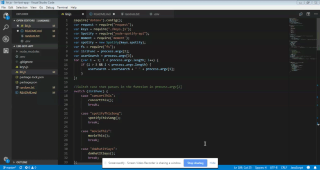
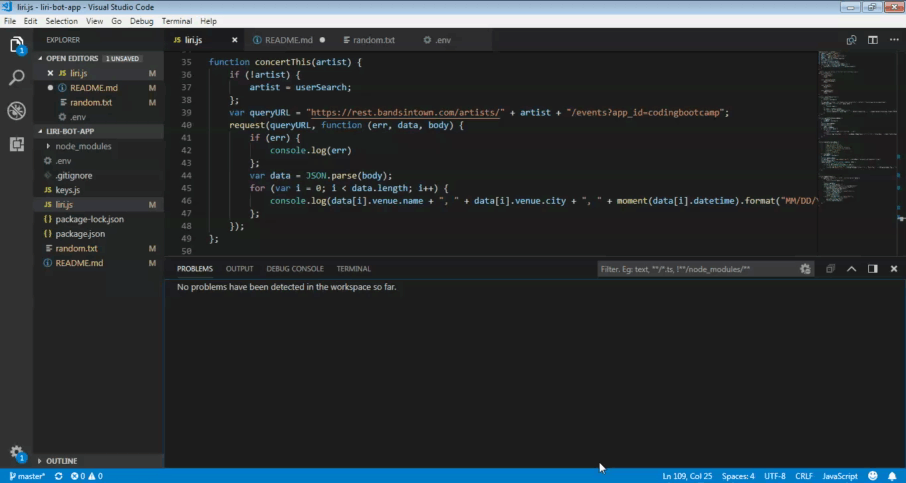
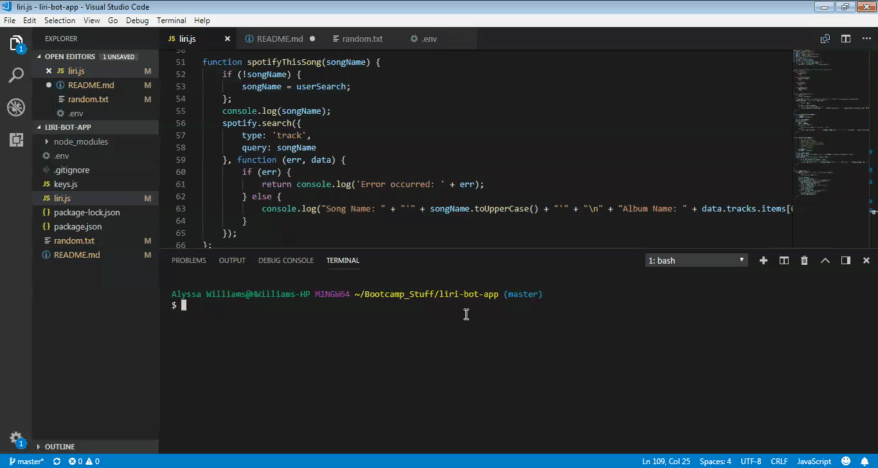
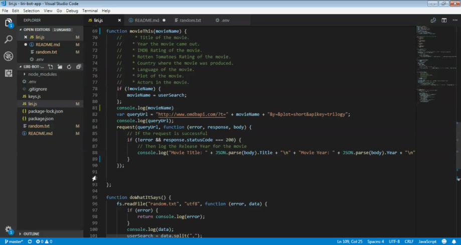
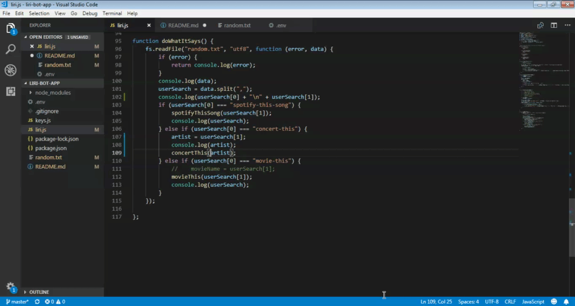

# liri-bot-app
### This node.js application takes a users input and logs either song, movie or concert data to the terminal.

### Better than your phone's voice, search your favorite songs to play via spotify, artists to see their upcoming concerts, or your favoirte movies to access all the info you need for movie trivia night! 

## Built Using
# Standard Javascript and Node.js

## Demo of the Liri Bot App!

## Installation, APIs and Credits!
# If you clone this repository, you will need to run an npm install  and make sure you have your own keys for the: 
- [Spotify API](https://developer.spotify.com/dashboard/) 
- [Node Spotify Package](https://www.npmjs.com/package/node-spotify-api) 
- [Bands In Town API](http://www.artists.bandsintown.com/bandsintown-api) 
- [OMDB API](http://www.omdbapi.com/) 

## Example Functionality

# Search for an artists upcoming concerts!

# Search for your favorite songs and head to spotify for a listen!

# Search for your favorite movies. Crush it at your next Movie Trivia!

# This node experience reads a separate file and runs the application based on what the text reads!

